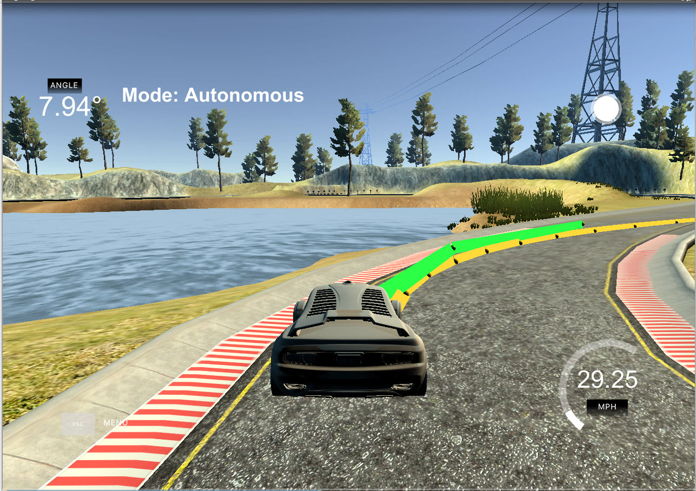
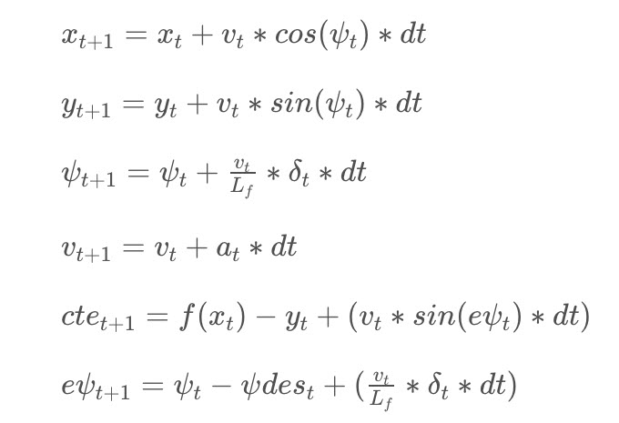

# P5 Model Predictive Control (MPC) 
Self-Driving Car Engineer Nanodegree Program

----

Here is MPC Screenshot:



# Rubric

##PROJECT SPECIFICATION
##Model Predictive Control (MPC)

###Compilation

####CRITERIA
####MEETS SPECIFICATIONS
Your code should compile.

# Reflections/Response:
My code compiles without errors with cmake and make.

No modifications were made CMakeLists.txt and code can compile on any platform.

###Implementation

####CRITERIA
####MEETS SPECIFICATIONS
####The Model

Student describes their model in detail. This includes the state, actuators and update equations.


# Reflection/Response:

Model Predictive Control (MPC) reframes the task of following a trajectory as an optimization problem.

The solution to the optimization problem is the optimal trajectory.  Model Predictive Control involves simulating different actuator inputs, predicting the resulting trajectory and selecting that trajectory with a minimum cost.

We start with knowing our current state and the reference trajectory we want to follow.  Then, we optimize our actuator inputs at each step in time in order to minimize the cost of our predicted trajectory.  Once we found the lowest cost trajectory, we implement the very first set of actuation commands.

Then, we throw away the rest of the trajectory we calculated. Instead of using the old trajectory we predicted, we take our new state and use that to calculate a new optimal trajectory.  

In that sense, we are constantly calculating inputs over a future horizon.  That's why this approach is sometimes called Receding Horizon Control.

Since the calculations are only approximations and may not always match the actual outcomes, it is crucial to constantly re-evaluate to find the optimal actuations.
 


---

MPC Equations: 


where `(x,y)` is position of the vehicle; 
`psi` is orientation of the vehicle; 
`v` is velocity; 
`delta` and `a` are actuators like steering angle and acceleration (throttle/brake combined); 

`Lf` measures the distance between the front of the vehicle and its center of gravity (the larger the vehicle, the slower the turn rate); 

`cte` is  cross-track error (the difference between the line and the current vehicle position y in the coordinate space of the vehicle); 
`epsi` is the orientation error. 

The vehicle model is implemented in the `FG_eval` class.


###Timestep Length and Elapsed Duration (N & dt)

Student discusses the reasoning behind the chosen N (timestep length) and dt (elapsed duration between timesteps) values. Additionally the student details the previous values tried.

# Reflection/Response:

Here I want to use Udacity class material to reflect on the importance of selecting appropriate T and N parameters.

The prediction horizon is the duration over which future predictions are made.  This is referred to as T.

In the case of driving a car, T should not be more than a few seconds.  If you make it beyond that horizon, the environment will change enough that it won't make sense to predict any further into the future.

T is the product of two other variables:  N and dt.

N is the number of timesteps in the horizon.
dt is how much time elapses between actuations.

I chose Timestep Length T and Elapsed Duration (N & dt)
by experimenting with different values.

I ending up using N = 10, dt = .1


####Number of Timesteps:
The goal of Model Predictive Control is to optimize the control inputs.  An optimizer will tune these inputs until a low cost vector of control inputs is found.  

The length of this vector is determined by N:

So, N determines the number of variables optimized by MPC.
This is also the major driver of computational cost.


----

###Polynomial Fitting and MPC Preprocessing

A polynomial is fitted to waypoints.

# Reflection/Response:

Here are the steps I used by MPC to follow the trajectory along a line:

1.  First I set N and dt
2.  Then, I fit the polynomial to the waypoints

MPC control receives the trajectory from simulator as an array of waypoints `ptsx` and `ptsy` in the World (map) coordinate space. 

3.  Next, I calculated initial cross track error and orientation error values

Next, I transformed waypoints into vehicle coordinate space.
Then, calculated cross-track error `(CTE)` and the orientation error `(EPSI)` in the vehicle coordinate space.


4.  Next, defined the components of the cost function (state, actuators, etc).

For prediction horizon T, MPC approximated the trajectory and calculated predicted values for N states with N-1 actuators.

5.  Then, defined the model constraints.  These are the state update equations.

----------

###Model Predictive Control with Latency

The student implements Model Predictive Control that handles a 100 millisecond latency. Student provides details on how they deal with latency.

# Reflections/Response:

Here I want to use Udacity class material to reflect on how MPC handles latency.

In a real car, an actuation command won't execute instantly.  There will be a delay as the command propagates through the system. 

One of the advantages of the Model Predictive Controller has over a PID Controller is that it can model latency in the system.  

The MPC models the actuator latency by using a simple dynamic system and incorporates it into the vehicle model.  One approach would be running a simulation using the vehicle model starting from the current state for the duration of the latency.  The resulting state from the simulation is the new initial state for MPC.  

This is how MPC can deal with 100 millisecond latency 
between sensors processing and actuation. 

To introduce latency of 100 ms into the model, the steering angle and throttle value are not changed for 100 ms.
```
      // Steering angle is not changed during latency
	this_thread::sleep_for(chrono::milliseconds(100));
                    ws.send(msg.data(), msg.length(), 
```


###Simulation

####CRITERIA
####MEETS SPECIFICATIONS
The vehicle must successfully drive a lap around the track.

# Reflections/Response:

See the following video (MP4 format.  I recorded in higher resolution, but converting to MP4 degraded video quality due to compression).


Here is MPC video:  If Markdown link does not work, just click on "P5_MPC_sub.mp4" file in folder.


Youtube:


Local MP4 File in Folder

My car successfully drives a lap around the track.

No tire left the drive-able portion of the track surface and the car does not pop up onto ledges or roll over any surfaces that would otherwise be considered unsafe for humans.

----
